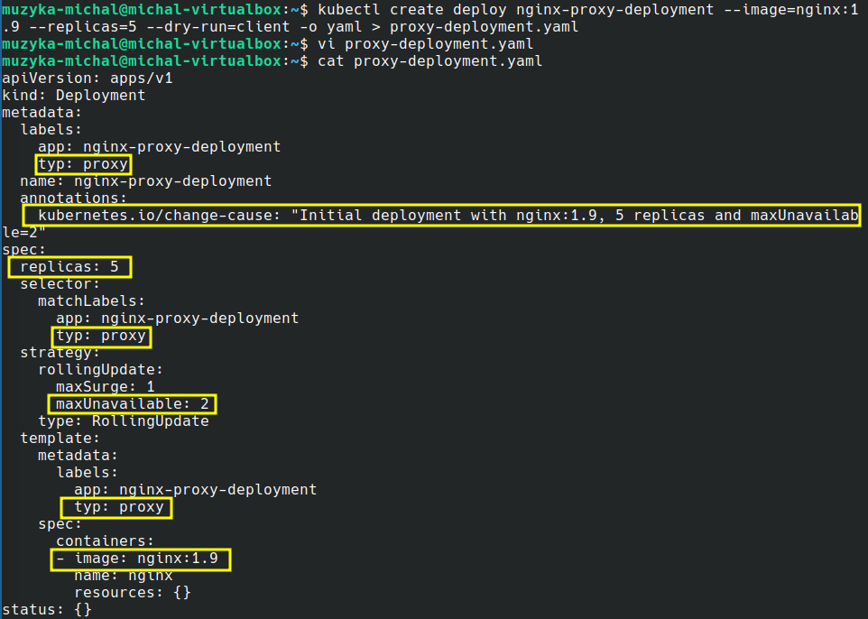
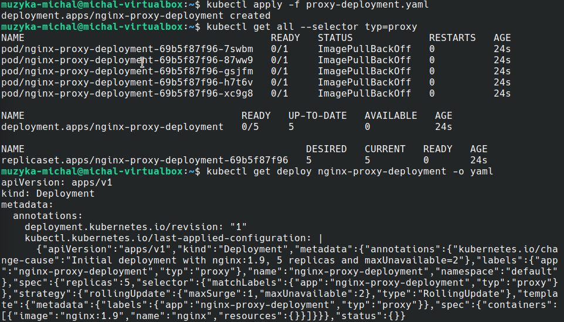
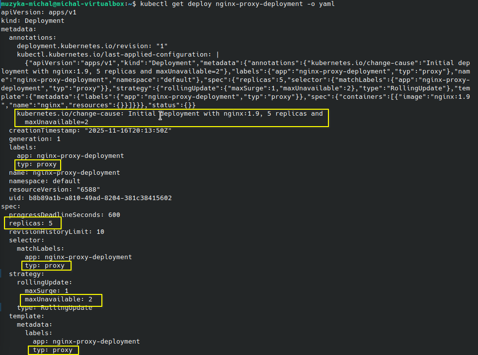
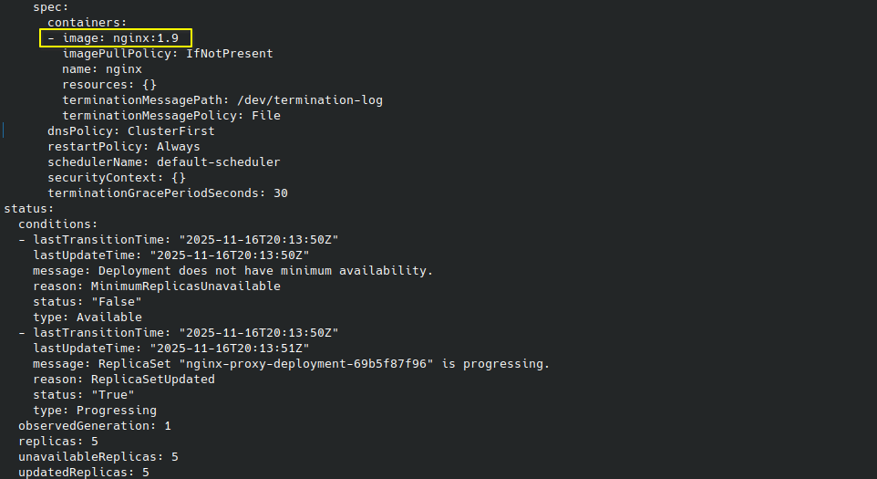
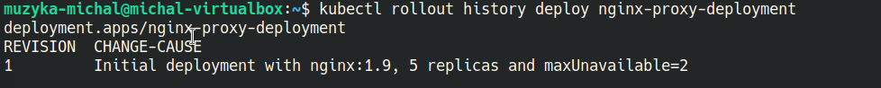
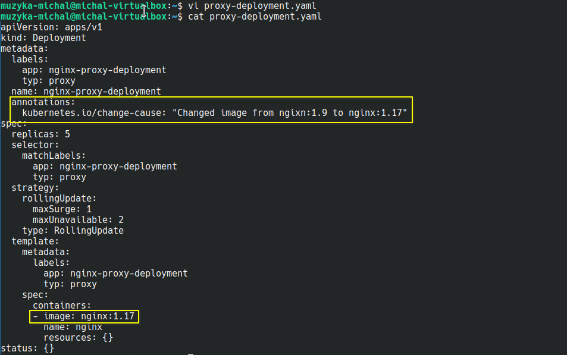
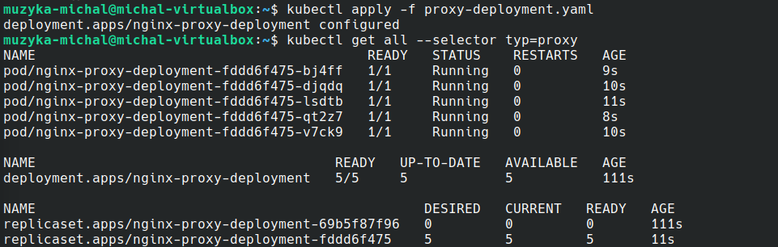
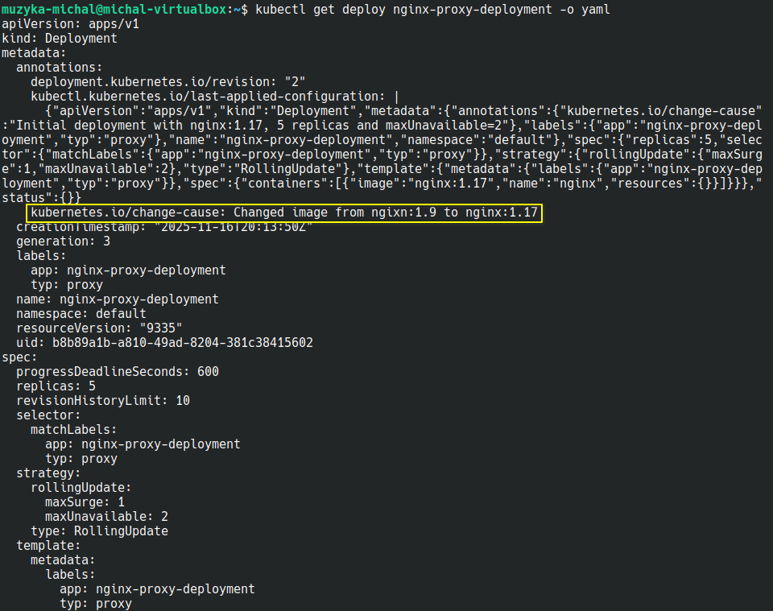
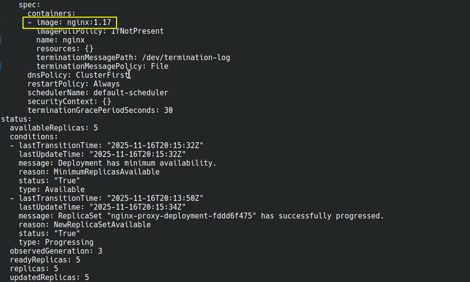
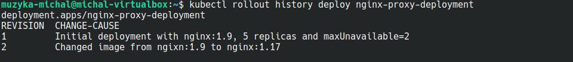

# Michał Muzyka 2.3 – Sprawozdanie Lab 6

### Tworzę plik YAML, który będzie manifestem dla Deployment wykorzystującego obraz serwera Nginx o wersji 1.9 z 5 replikami. Edytuję plik i ustawiam strategię aktualizacji RollingUpdate z nie więcej niż 2 podami niedostępnymi w tym samym czasie podczas aktualizacji. Dodaję również adnotację opisującą wersję aplikacji i etykietę typ=proxy.

### Uruchamiam Deployment. Wyświetlam wszystkie zasoby w bieżącym namespace z etykietą typ=proxy. Jest problem z pobraniem obrazu.

### Sprawdzam jednak konfigurację obiektu w formacie YAML, czy ustawione parametry są prawidłowe. Są prawdiłowe.

### Weryfikuję, czy adnotacja CHANGE-CAUSE została poprawnie zapisana w historii wdrożenia. Została zapisana poprawnie.

### Dodatkowo, poza zadaniem, aby wdrożenie jednak zostało uruchomione poprawnie, zmieniam wersję obrazu z 1.9 na 1.17, zmieniam też adnotację.

### Aplikuję zmiany. Pody tym razem działają.

### Weryfikuję zmiany obiektu w formacie YAML. Dokonane zmiany są widoczne.

### Weryfikuję historię wdrożenia. Widoczna jest druga wersja.

